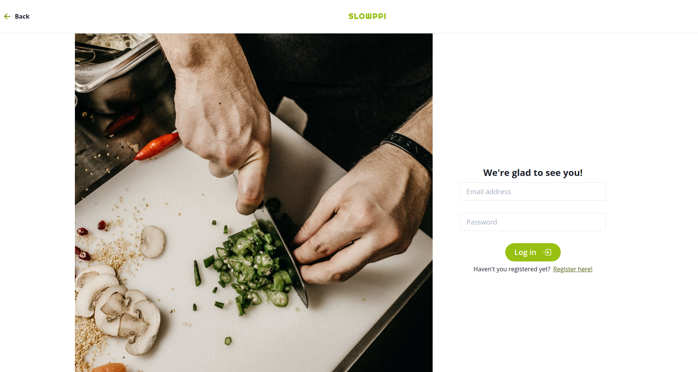

# Slowppi

React application that allows users to make reservations consuming the [Slowpi Backend](https://github.com/leonardodiasb/final-capstone-back-end)

## Table of contents

- [Overview](#overview)
  - [Screenshot](#screenshot)
  - [Live Demo](#live-demo)
  - [Available scripts](#available-scripts)
- [My process](#my-process)
  - [Built with](#built-with)
- [Acknowledgments](#acknowledgments)
- [Author](#author)

## Overview

### Screenshot



### Live Demo

- [Slowppi](https://slowppi.netlify.app/)

### Available Scripts

- Clone this repository
```bash
$ git clone git@github.com:alonsofl/slowppi-frontend.git
$ cd slowppi-frontend/
```

- Run the app
```bash
$ npm start # Runs the app in the development mode.
```

- Or build
```bash
$ npm run build # Builds the app for production to the `build` folder.
```

## My process

### Built with

- React
- [Chakra UI](https://chakra-ui.com/)

## Acknowledgments

- Original design idea by [Murat Korkmaz on Behance](https://www.behance.net/gallery/26425031/Vespa-Responsive-Redesign)

## Author

**Abimbola Buari**
- GitHub: [@bimbolabuari](https://github.com/bimbolabuari)
- Twitter: [@bimbolabuari](https://twitter.com/bimbolabuari)
- LinkedIn: [@bimbolabuari](https://www.linkedin.com/in/bimbolabuari)

**Alonso Falconi**
- GitHub - [@alonsofl](https://github.com/alonsofl)
- LinkedIn - [Alonso Falconi](https://www.linkedin.com/in/alonsofalconi/)

**Daniel Jaramillo**
- GitHub: [@d4nielj](https://github.com/d4nielj)
- Twitter: [@d4niel_jm](https://twitter.com/d4niel_jm)
- LinkedIn: [d4nielj](https://linkedin.com/in/d4nielj)

**Leonardo Dias**
- GitHub: [@leonardodiasb](https://github.com/leonardodiasb)
- Twitter: [@BussularDias](https://twitter.com/BussularDias)
- LinkedIn: [Leonardo Dias Bussular](https://www.linkedin.com/in/leonardo-dias-bussular-a67392178/)

Give a ⭐️ if you like this project!